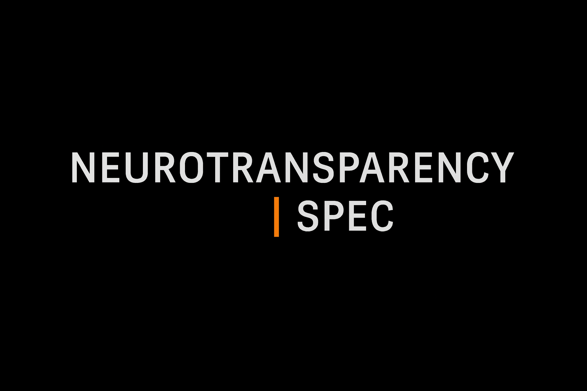

<p align="center">
  
</p>

# Neurotransparency Specification (NTS) v1.1.0  
*Formal normative standard for cognitive traceability in AI–human scientific workflows*

**Waveframe Labs · Aurora Research Initiative (ARI)**  
[](https://waveframelabs.org)
[](https://github.com/Waveframe-Labs/Aurora-Research-Initiative)  
[](https://doi.org/10.5281/zenodo.17809676)  
[](LICENSE)
  
[](https://orcid.org/0009-0006-6043-9295)  


---

## Overview

The **Neurotransparency Specification (NTS)** defines the formal, normative,
machine-verifiable rules required for cognition—human or synthetic—to
legitimately influence scientific claims under ARI governance.

Where the **Neurotransparency Doctrine** defines *why* cognitive traceability is
required, the NTS defines *how* it must be implemented through:

- structural schemas  
- attribution and evidence requirements  
- validation constraints  
- role-separation enforcement  
- integrity guarantees  
- compliance targets for CRI-CORE  

Together, the Doctrine and Specification form **Layer 0** of ARI’s reproducibility stack.

---

## Repository Structure
```
/specification - Canonical NTS v1.1.0 document (Markdown)
/figures - Banners and visual assets
LICENSE - CC BY 4.0 license
CITATION.cff - Citation metadata
descriptor.yml - Repository descriptor for ARI governance
```

---

## PDF Artifact

The canonical PDF for **NTS v1.1.0** is generated deterministically using
**Waveframe PDF Forge** and attached as a release asset for the tagged version.

The PDF is **not committed** to the repository.

---

## Citation

Please cite the specification using the metadata in `CITATION.cff`.

---
<p align="center">
  <sub><strong>© 2025 Waveframe Labs</strong> · Independent Open-Science Research Entity · 
  <a href="https://orcid.org/0009-0006-6043-9295">ORCID: 0009-0006-6043-9295</a> · 
  <a href="https://doi.org/10.5281/zenodo.17809676">DOI: 10.5281/zenodo.17809676</a></sub>
</p>

<p align="center">
  <sub>Governed under the <a href="https://github.com/Waveframe-Labs/Aurora-Research-Initiative">Aurora Research Initiative (ARI)</a></sub>
</p>
